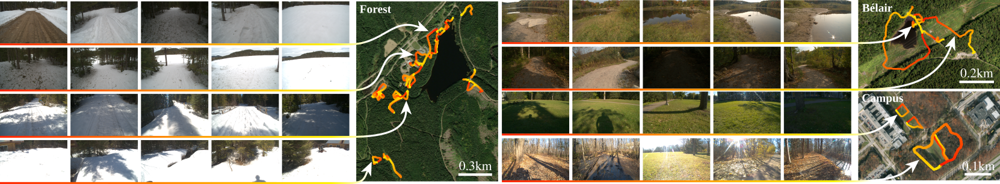

<p float="center">
  
</p>

# Reproducible Evaluation of Camera Auto-Exposure Methods in the Field: Platform, Benchmark and Lessons Learned

This repository contains the code used in our paper *Reproducible Evaluation of Camera Auto-Exposure Methods in the Field: Platform, Benchmark and Lessons Learned* submitted to Transaction on Field Robotics for the ICRA2024 Workshop special issue.

The repository will continue to grow in the following weeks, but for now, we provide a first restricted version of the code that allows to run the whole pipeline (emulation and ORB-SLAM2) with a sample from the dataset.

You can also access the original BorealHDR dataset and code from our IROS2024 paper *Exposing the Unseen: Exposure Time Emulation for Offline Benchmarking of Vision Algorithms* at the following link [BorealHDR](https://github.com/norlab-ulaval/BorealHDR).

## Run on the sample dataset

We created a Dockerfile to easily run our code using a docker-compose.yaml.

### Dependencies

If you want to use the docker container, you have to install Docker using this website: [https://docs.docker.com/engine/install/](https://docs.docker.com/engine/install/)

### First steps

We will first start by a running a version of the code using a small sample of the dataset and running with the default parameters. 

Start by cloning this repository on your computer. 
```bash
git clone git@github.com:norlab-ulaval/TFR24_BorealHDR.git
```

#### Docker

You can open the devcontainer in `vscode` if you are familiar, or build the image with `docker compose up --build`.
```bash
cd TFR24_BorealHDR/.devcontainer/
docker compose up --build
```

After finishing building the docker image, you can connect to it from a **new terminal**
```bash
docker exec -it tfr2024_borealhdr /bin/bash
```

When you are inside the docker container, you will have to build `ORB-SLAM2`
```bash
cd /home/user/code/ORB_SLAM2/
./build.sh
```

Then, you can run the whole pipeline by doing the following steps
```bash
cd /home/user/code/scripts/full_pipeline_scripts/
./run_full.sh
```

You will find a video of the emulated sequence in the `/home/user/code/results/` folder with also the resulting trajectory from `ORB-SLAM2`.
To adjust the automatic-exposure methods you want to evaluate, you can modify in `run_full.sh` the following variables: `methods_all`, `methods_orb_1`, and `methods_orb_2`.


